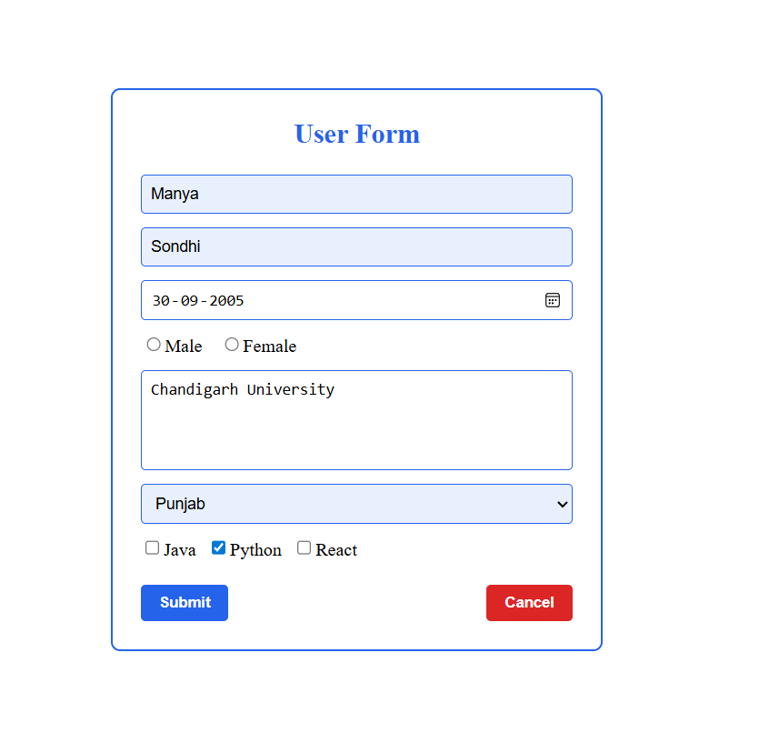
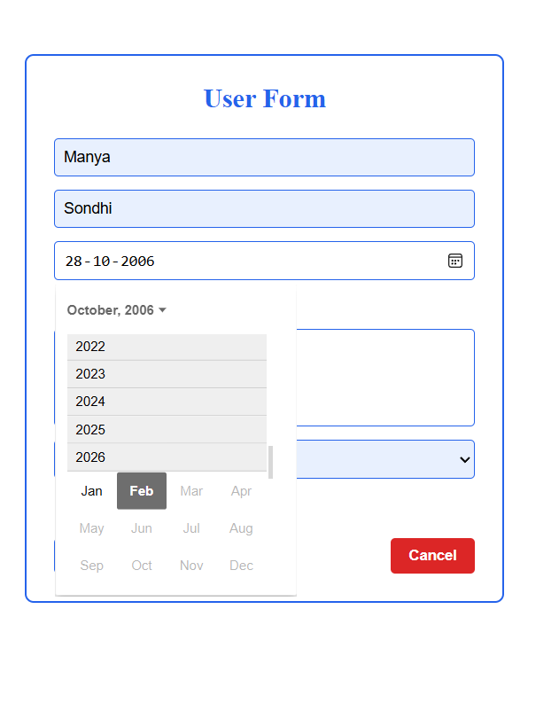
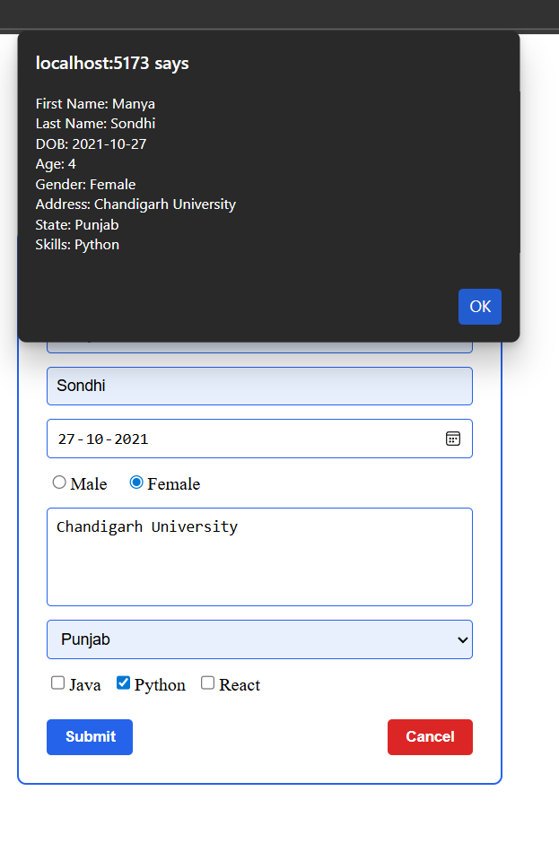
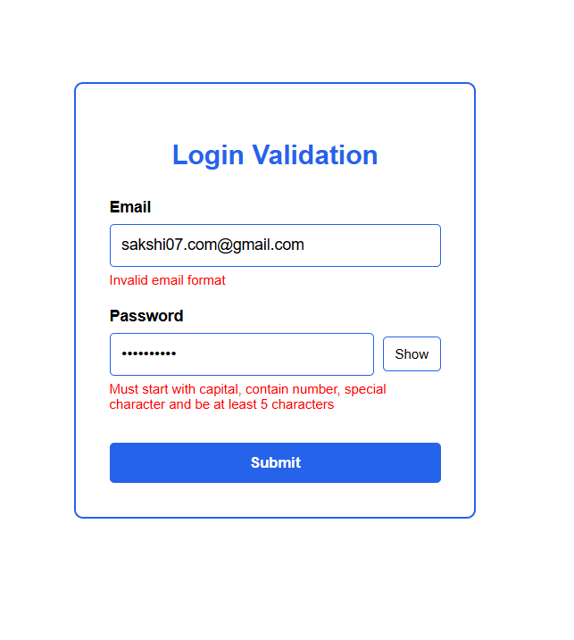
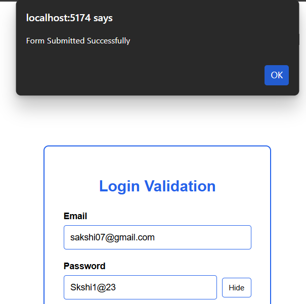

# React Form Handling & Validation Experiments

This repository contains two frontend experiments built using **React (Vite)**.

---

# 📌 Experiment 1: Controlled Form Handling

## 🎯 Aim
To create and manage form inputs using controlled components in React.

---

## 🧠 Features

- First Name
- Last Name
- Date of Birth
- Automatic Age Calculation (shown on submit)
- Gender Selection
- Address
- Indian States Dropdown
- Skills (Checkbox)
- Submit & Cancel
- Future Date Restriction
- Age Validation

---

## 🖼 Form UI

---

## 🖼 Date of Birth Selection

---

## 🖼 Alert Showing Calculated Age

---

# 📌 Experiment 2: Client-Side Form Validation

## 🎯 Aim
To validate email and password fields before form submission.

---

## 📧 Email Validation Rules

- Must contain exactly one `@`
- No dot before `@`
- Only letters and numbers allowed before `@`
- Must end with `.com`, `.in`, or valid country code

---

## 🔐 Password Validation Rules

Password must:

1. Start with a capital letter  
2. Contain at least one number  
3. Contain at least one special character  
4. Be minimum 5 characters long  

---

## 🖼 Validation Error Display

---

## 🖼 Successful Validation Output

---

# 🚀 Tech Stack

- React
- Vite
- JavaScript
- CSS
- Regular Expressions

---

# 📚 Learning Outcomes

- Controlled Components
- useState Hook
- Regex Validation
- Conditional Rendering
- Handling Edge Cases
- UI Structuring

---

# 👩‍💻 Author
Manya